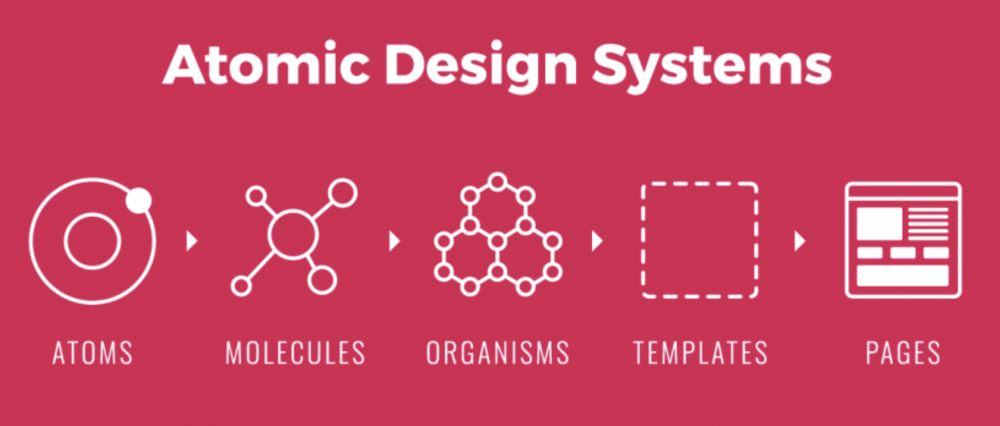
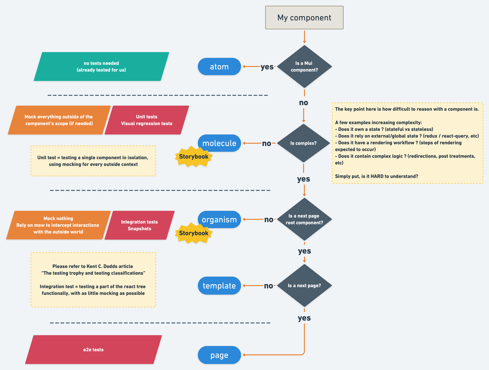
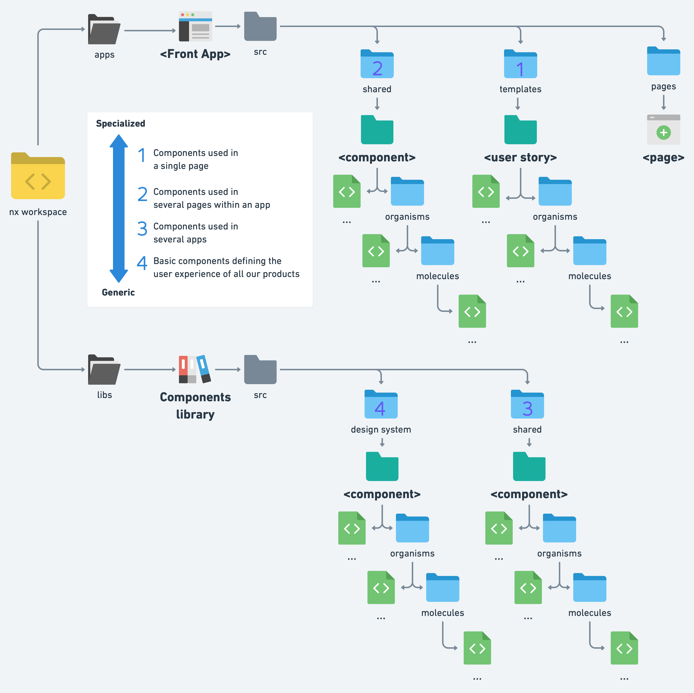

# ⚡ Frontend architecture - working with an application containing many components

Our goal here is to classify components in order to know easily how we should test them: some components are simple and may only need a few unit tests to get the team confident about their robustessness. On the other hand, others may be quite complex, embedding interactions with the outside world, or complex logic for example.

Categorizing components can also help us defining what could be a milestone for us in the delivery of a user story.



We can use [atomic design](https://atomicdesign.bradfrost.com/chapter-2/) as a basis to classify our components.

But why even doing this in the first place, anyway? 🤔

## 🔶 Common language used in tech team and in product team

It's easier to work together if a common language is used by both the product team and the dev team, instead of having a purely technical way to define components on one side, and a product driven definition on the other side.

## 🔶 Removing ambiguity about testing

How should I test my component? Which rules should I follow when testing it? Why should I even choose that testing strategy instead on another?

We can make it easier for every developer in our team to answer these questions right away by binding a testing strategy to each type of component. This clarifies what is expected for a component as well, for code reviews.

## 🔶 Plan ahead

Classifying components will make it easier for us on the long run: we will be able to reason by scale and to use a divide & conquer approach when preparing a user story. This page contains two independent parts with complex rendering? Well, that means we will have two organisms then! That means we will write two integration tests!

## 🔶 Clarify the amount of job that needs to be done

It also can help us refine our estimations when we want to know how complex a user story is, by taking a look at the provided UI model. We can easily split it down in organisms, which themselves will be made with molecules, etc... Sizing the user story will be much easier by taking this approach.

## 🔶 Create milestones

Using storybook, we can easily demonstrate how well is advancing the user story, and validate distinct parts of the user story with product team.

# ⚡ Cool, but what does it mean concretely?

## 🔶 Classifying our components

Let's reflect on the classification we want to use and how it would impact our folders structure. Here is a proposal:

| Category  | Description                                                                                                                                                                                                          |
| --------- | -------------------------------------------------------------------------------------------------------------------------------------------------------------------------------------------------------------------- |
| Atoms     | Since we are using an UI library (Mui), we can consider components coming from this library to be **Atoms**. Somebody also is responsible for testing them, so no need to do that!                                   |
| Molecules | Simple components only do one thing. They have little to no logic on their own; they often are just presentational                                                                                                   |
| Organisms | Some compoents are bigger, embedding complex logic or having sophisticated rendering logic. This is often where something can go wrong in our app: several small blocks having to work together to come to a result. |
| Templates | We may want to create a 1-1 relationship between user stories and **Templates**. In that context, templates would be the root component of an entire page, made from several organisms                               |
| Pages     | Finally **Pages** would pretty much be nextjs pages...                                                                                                                                                               |

## 🔶 Defining a decision tree to identify components types

With this in mind, we can now think about a decision tree to identify the type of one component. We will also take advantage of this to define a few things:

- What should and shouldn't be on storybook.
- Which testing strategy should be used for each category.



## 🔶 Multi-apps environment

Splitting our frontend in several apps can help us a lot:

- Cognitive load mitigation: the bigger a codebase is, the harder it is to maintain. It's easier for a developer when the context he has to insert into is small.
- Apples and tomatoes: Our product may be made of modules with distinct structure (even if they share the same system design). For example we may have an admin app that is a dashboard while the customers app is mobile oriented.
- Decoupled deployments: Multi apps means distinct deployments, which is awesome for flexibility.

Now, several apps means shared code. `nx` will help us in that regard. For example, we may have three levels of components, from specific to generic:

- Some components will be only used in one single story (no reusability).
- Some components will be specific to a single app (should be reused only within the app).
- Finally, some components will be highly generic and reused accross several apps.

We will also need a library embedding storybook config, so that we only expose a single storybook for all our apps or at least for the design system: once we scale up, we might want to have one storybook by application.



A few things to mention here.

### 🧿 Components categories

#### 🎁 `molecules` and `organisms` folders

We might see these folders at several levels, depending on the complexity of the current component: some might be very simple (no need to split them in smaller components) while some may a universe on their own, forcing us to use composition (by splitting them in smaller entities, we will be able to limit the cognitive load needed to understand each part).

#### 🎁 `templates` folder

The `templates` folder will contain one folder by user story. We can consider a user story equals a page (1 to 1 relationship with pages), or that a page will be made of several templates.

#### 🎁 `Pages` folder

The `pages` folder comes from nextjs. Each component in this folder will be a page served by next.

### 🧿 Assets

Our shared library may use assets, like images or icons. These files will be stored in the `assets` folder at library root. When starting or building a next app using that library, we will have to copy these assets to the app `public` folder, using the build script in `project.json`:

```json
{
  // ...
  "targets": {
    // ...
    "build": {
      "executor": "@nrwl/next:build",
      "outputs": ["{options.outputPath}"],
      "defaultConfiguration": "production",
      "options": {
        "root": "apps/front",
        "outputPath": "dist/apps/front",
        // Integrating assets outside of the application public folder
        "assets": [
          {
            "input": "libs/front/components/assets",
            "glob": "**/*",
            "output": "."
          }
        ]
      },
      "configurations": {
        "production": {}
      }
    }
  }
}
```

### 🧿 Storybook

#### 🎁 Node library

We will be using a node library to build storybook. Let's define a `build` task in `front-storybook-lib`.

`project.json`:

```json
{
  // ...
  "targets": {
    // Building storybook
    "build": {
      "executor": "@nrwl/storybook:build",
      "outputs": ["{options.outputPath}"],
      "options": {
        "uiFramework": "@storybook/react",
        "outputPath": "dist/apps/storybook/public/storybook",
        "config": {
          "configFolder": "libs/front/storybook/.storybook"
        }
      },
      "configurations": {
        "ci": {
          "quiet": true
        }
      }
    }
    // ...
  }
}
```

We might also want to launch storybook in watch mode (dev):

```json
{
  // ...
  "targets": {
    // Launching storybook in watch mode
    "dev": {
      "executor": "@nrwl/storybook:storybook",
      "options": {
        "uiFramework": "@storybook/react",
        "port": 4400,
        "config": {
          "configFolder": "libs/front/storybook/.storybook"
        },
        // Defining assets location
        "assets": [
          {
            "input": "apps/front/public",
            "glob": "**/*",
            "output": "."
          },
          {
            "input": "apps/storybook/public",
            "glob": "**/*",
            "output": "."
          },
          {
            "input": "libs/front/components/assets",
            "glob": "**/*",
            "output": "."
          }
        ]
      },
      "configurations": {
        "ci": {
          "quiet": true
        }
      }
    }
  }
}
```

Then, let's take all the story files in all our apps or our libs, and let's add all the assets to storybook, via `main.js`:

```javascript
/** @type {import("@storybook/react/types/index").StorybookConfig} */
const storybookMainConfig = {
  // ...
  stories: ['../../../../**/*.stories.mdx', '../../../../**/*.stories.tsx'],
  staticDirs: [
    '../../../../apps/front/public',
    '../../../../libs/front/components/assets',
  ],
};

module.exports = storybookMainConfig;
```

#### 🎁 Next app

We will use a next app to serve our storybook build. This app can be served using vercel for example. Let's take a look at the tasks for this app:

`project.json`:

```json
{
  // ...
  "targets": {
    // Build the next app, building storybook first (calling front-storybook-lib:build)
    "build": {
      "executor": "@nrwl/next:build",
      "outputs": ["{options.outputPath}"],
      "defaultConfiguration": "production",
      "options": {
        "root": "apps/storybook",
        "outputPath": "dist/apps/storybook"
      },
      "dependsOn": [
        {
          "projects": "dependencies",
          "target": "build"
        }
      ],
      "configurations": {
        "development": {
          "outputPath": "dist/apps/storybook"
        },
        "production": {}
      }
    }
  },
  // Depending on the storybook library
  "implicitDependencies": ["front-storybook-lib"]
}
```

# ⚡ A concrete example: this repo

This repo contains one frontend application serving two pages: a signup page and user profile page. In order to create this pages, we use components with various degrees of genericity:

- The most specialized ones are in the user story folder, for example [CheckBoxList component](./../apps/front/src/templates/signup-form/organisms/skills/organisms/checkbox-list/) used in the skills part of the signup page.
- Others components are used in several pages of our application, like [FullpageBox component](./../apps/front/src/shared/fullpage-box/).
- We then have specialized components built on top of the design system, for example the [Brand component](./../libs/front/components/src/shared/data-display/brand/).
- Finally, we have design system components, the most basic components that will serve as a base for our specialized components. For example an input like [PasswordInput component](./../libs/front/components/src/design-system/inputs/password-input/).
