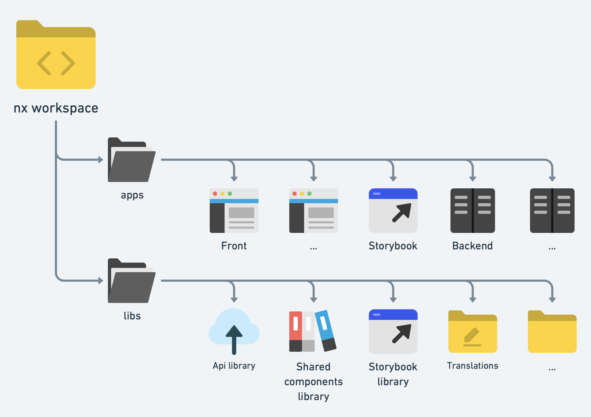

# ⚡ nx

We will be using [Nx](https://nx.dev) to make sure we can use several frontend apps, and to share code between them. Nx also has a cloud service that does pretty cool stuffs, like caching runs results, allowing us to save a lot of time for parts of the codebase that had no changes.

## 🔶 nx magnets, how do they work?

So how does nx work? We first have to talk about applications and libraries.



### 🧿 Applications

In a nx workspace, the `apps` folder contains all the available applications. Applications can be easily bootstraped using generators. There is a lot of already available generators, like [`@nrwl/react`](https://nx.dev/react/overview), [`@nrwl/nest`](https://nx.dev/nest/overview), [`@nrwl/next`](https://nx.dev/next/overview), [`@nrwl/storybook`](https://nx.dev/storybook/overview-react) and so on.

So to create a next app, I simply have to do this:

```bash
nx g @nrwl/next:app my-new-app
```

In our example, we will have two apps:

- 📗 A frontend, based on [nextjs](https://nextjs.org/docs/getting-started).
- 📗 A backend, based on [nestjs](https://docs.nestjs.com).

### 🧿 Libraries

Libraries contain code that will be shared between several apps. They are defined in the `libs` folder. Then again, libraries can be bootstraped using generators, like [`@nrwl/node`](https://nx.dev/node/overview), for example.

In our example, we will be using four libs:

- 📗 A library containing the types shared between frontend and backend (api types).
- 📗 A library containing react components that could be shared between several apps.
- 📗 A library centralizing the logic related with building and serving storybook.
- 📗 A library containing an implementation mockup for translations used in our frontend app.

## 🔶 nx configuration

Regarding nx, we have two levels of configuration. One at root level and one for each app/lib.

### 🧿 `workspace.json`

The `workspace.json` file is defined at root level and keeps track of the available apps and libs. It contains a path by item:

```json
{
  // ...
  "projects": {
    "back": "apps/back",
    "front": "apps/front",
    "storybook": "libs/front/storybook",
    // ...
  }
}
```

### 🧿 `project.json`

Each app/lib contains a `project.json` file that defines the available commands for this item.
For example, here is a project file defining five tasks:

- `build` (building the application)
- `serve` (launching the application in dev mode)
- `test` (launching test using jest)
- `type-check` (launching tsc to validate types)
- `lint` (linting our app).

Each command uses an executor, for example `@nrwl/workspace:run-commands` to simply run a command.

```json
{
  "root": "apps/front",
  "sourceRoot": "apps/front",
  "projectType": "application",
  "targets": {
    "build": {
      "executor": "@nrwl/next:build",
      "outputs": [
        "{options.outputPath}"
      ],
      "defaultConfiguration": "production",
      "options": {
        "root": "apps/front",
        "outputPath": "dist/apps/front",
        "assets": [
          {
            "input": "libs/front/components/assets",
            "glob": "**/*",
            "output": "."
          }
        ]
      },
      "configurations": {
        "production": {}
      }
    },
    "serve": {
      "executor": "@nrwl/next:server",
      "options": {
        "buildTarget": "front:build",
        "dev": true,
        "port": 3000
      },
      "configurations": {
        "production": {
          "buildTarget": "front:build:production",
          "dev": false
        }
      }
    },
    "test": {
      "executor": "@nrwl/jest:jest",
      "outputs": [
        "coverage/apps/front"
      ],
      "options": {
        "jestConfig": "apps/front/jest.config.js",
        "passWithNoTests": true
      }
    },
    "type-check": {
      "executor": "@nrwl/workspace:run-commands",
      "options": {
        "command": "pnpm exec tsc -p ./apps/front/tsconfig.base.json --noEmit --pretty"
      }
    },
    "lint": {
      "executor": "@nrwl/linter:eslint",
      "outputs": [
        "{options.outputFile}"
      ],
      "options": {
        "lintFilePatterns": [
          "apps/front/**/*.{ts,tsx,js,jsx}"
        ]
      }
    }
  }
}
```

## 🔶 CLI

nx comes with [its own CLI](https://nx.dev/l/n/getting-started/nx-cli). Here is a short list of commands that may be handy:

### 🧿 miscellaneous

| Description                                           | Command                                                               |
| ------------------------------------------------ | --------------------------------------------------------------------- |
| 🆘 Get help!!!| `pnpm exec nx help` |
| 📊 Dependencies graph                             | `pnpm exec nx dep-graph`                                                   |

### 🧿 Running actions

| Description                                           | Command                                                               |
| ------------------------------------------------ | --------------------------------------------------------------------- |
| ▶️ Run an action on one project                             | `pnpm exec nx run <project>:<action>`           |
| ▶️ Run an action on all projects                             | `pnpm exec nx run-many --target=<action> --all`           |
| ▶️ Run an action on a set of projects                         | `pnpm exec nx run-many --target=<action> --projects=<project1>,<project2>`              |
| ▶️ Run an action only on projects containing changes | `pnpm exec nx affected:<action>`                                              |

#### 🎁 Typical actions

Actions are defined by project in `project.json` files. Here are a few standard actions:

| Action                                           | Description                                                               |
| ------------------------------------------------ | --------------------------------------------------------------------- |
| 🛠️ build  | Builds the app/lib. Use `--prod` flag for a production build |
| 🚀 serve  | Runs the app  |
| ⚠️ lint  | Run the linter against project files  |
| ✔️ type-check  | Uses `tsc --noEmit` to validate types against project files |
| ✅ test  | Runs tests |
| ☑️ e2e  | Runs end to end tests |

#### 🎁 Useful flags

| flag                                           | Description                                                               |
| ------------------------------------------------ | --------------------------------------------------------------------- |
| ⬛  `--target=x`  | specifies which action to run |
| ⬛  `--skip-nx-cache`  | disables nx caching; the command will be ran fully |
| ⬛  `--verbose`  | prints additional error stack trace on failure
| ⬛  `--projects=x,x`  | `run-many`: specifies which projects to run the action against |
| ⬛  `--parallel=x`  | `run-many`: allows x tasks to be ran in parallel |

### 🧿 Running tests

| Description                                           | Command                                                               |
| ------------------------------------------------ | --------------------------------------------------------------------- |
| ✅ Run tests for a project (watch)         | `pnpm test-changes <project>` or `pnpm exec nx test --project=<project> --watch`                                        |
| ✅ Run all tests for a project (watchAll)     | `pnpm test-dev <project>` or `pnpm exec nx test --project=<project> --watchAll`                                                |
| ✅ Run all tests                                  | `pnpm test-all` or `pnpm exec nx run-many --target=test --parallel --all`                                                       |

### 🧿 Creating applications or libraries

| Description                                           | Command                                                               |
| ------------------------------------------------ | --------------------------------------------------------------------- |
| 🗃️ Create a new front app or lib                           | `pnpm exec nx g @nrwl/react:app <appname>` or  `pnpm exec nx g @nrwl/react:lib <appname>`                                                  |
| 🗃️ Create a new backend app or lib                            | `pnpm exec nx g @nrwl/nest:app <appname>` or `pnpm exec nx g @nrwl/nest:lib <appname>`                                                   |
| 🗃️ Create a vanilla node lib                            | `pnpm exec nx g @nrwl/node:lib <libname>`                                                   |
