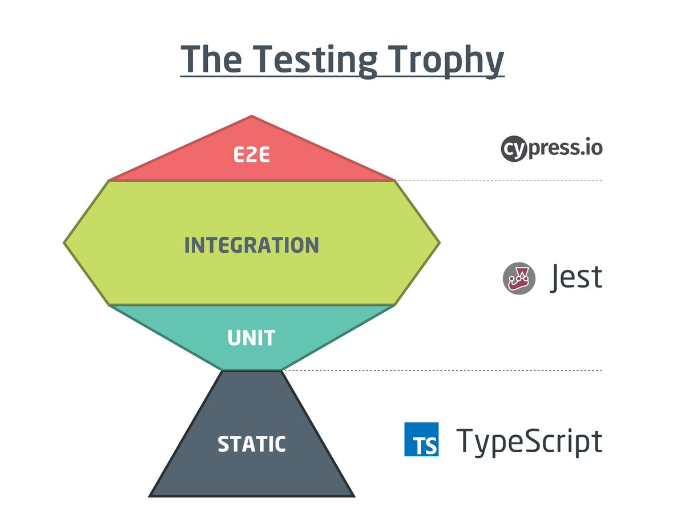

# ⚡ Testing

Let's talk a bit about the various types of tests we can do and what problems they do solve.

What we aim to do is trophy testing, basing ourself on [Typescript](https://www.typescriptlang.org), [jest](https://jestjs.io), [testing library](https://testing-library.com), [msw](https://mswjs.io) and [cypress](https://www.cypress.io).



## 🔶 Unit tests

They focus on testing a module - could be a component or a function - in isolation. That means any outside context this module may rely upon will be mocked. This are pretty straightforward tests, which are typically really fast.

You can find unit tests in the [molecules or organisms folder of the shared components library](./../libs/front/components/src/molecules). Here is a simple example:

```typescript
describe('Brand component', () => {
  it('should display brand informations', () => {
    render(<Brand color="white" />);

    expect(screen.getByText('Sandbox')).toBeInTheDocument();
    expect(
      screen.getByText('nextjs / react-hook-form / testing-library')
    ).toBeInTheDocument();
  });
});
```

## 🔶 Visual regression tests

These tests check that the small bricks of our app didn't drastically change visually. This is pretty useful when we defined our own system design relying on a whole set of generic components.

## 🔶 Snapshots

Snapshots are useful to make sure we didn't visually break another part of the application by touching a generic component for example.

You can find snapshot tests in the templates folder of the front app:

- [Logged user home](./../apps/front/src/templates/logged-user-home/LoggedUserHome.spec.tsx).
- [Signup form](./../apps/front/src/templates/signup-form/SignupForm.spec.tsx).

```typescript
describe('snapshots', ()=> {
  it('should match snapshot when loading', () => {
    msw.userDataQuery(200, undefined);
  
    const { baseElement } = render(<LoggedUserHome />);
  
    expect(baseElement).toMatchSnapshot();
  });

  it('should match snapshot when displaying user data', async () => {
    msw.userDataQuery(200, mockedSignedUser);
  
    const { baseElement } = render(<LoggedUserHome />);
  
    await waitForElementToBeRemoved(() => screen.queryByRole('progressbar'));

    expect(baseElement).toMatchSnapshot();
  });
})
```

## 🔶 Integration tests

Integration tests have the highest return on investment because they are not as hard to write and maintain as e2e tests while giving us good confidence about a part of our system.

You can find integration tests in the templates folder:

- [Logged user home](./../apps/front/src/templates/logged-user-home/LoggedUserHome.spec.tsx).
- [Signup form](./../apps/front/src/templates/signup-form/SignupForm.spec.tsx).

```typescript
it('should display user data', async () => {
  msw.userDataQuery(200, mockedSignedUser);
  
  render(<LoggedUserHome />);
  
  await waitForElementToBeRemoved(() => screen.queryByRole('progressbar'));
  
  expect(screen.getByText(
    `${mockedSignedUser.firstName} ${mockedSignedUser.lastName}`
  )).toBeInTheDocument();
  expect(screen.getByText(`${mockedSignedUser.userName}`)).toBeInTheDocument();
});
```

## 🔶 End to end testing

The tests giving us the most confidence. They also cost a lot. So it's generally wiser to only write e2e for key features of our application; the ones that represent a critical risk for the product.
